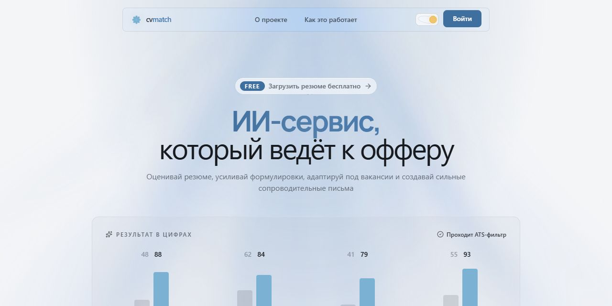
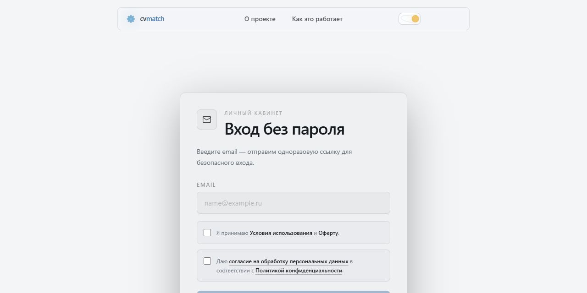
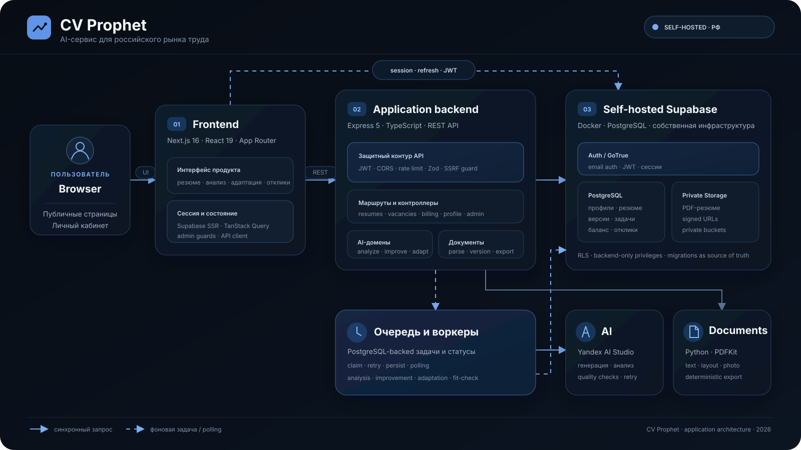

# CV Prophet

CV Prophet — AI-сервис для анализа, улучшения и адаптации резюме под российский рынок труда. Приложение хранит версии резюме, помогает подготовить сопроводительное письмо, проверяет соответствие вакансии и ведёт историю откликов и интервью.

## Возможности

- загрузка PDF-резюме, извлечение структуры и редактирование в браузере;
- анализ качества резюме с оценкой разделов и рекомендациями;
- улучшение резюме после точечных вопросов по конкретным пробелам без выдумывания фактов;
- адаптация под вакансию, fit-check и объяснение внесённых изменений;
- генерация сопроводительных писем;
- версионирование и детерминированный PDF-экспорт;
- трекер откликов, интервью и офферов;
- токены, промокоды, профиль пользователя и защищённая админ-панель.

## Интерфейс

| Главная страница | Вход без пароля |
| --- | --- |
|  |  |

## Стек проекта

| Слой | Технологии | Назначение |
| --- | --- | --- |
| Frontend | Next.js 16, React 19, TypeScript 5, App Router | публичные страницы, личный кабинет и server-side guards |
| UI и состояние | TanStack Query 5, React Hook Form, Zod 4, Radix UI, Lucide React, Tailwind CSS 4, CSS Modules, Lenis | формы, API-состояние, компоненты, анимации и валидация |
| Backend | Node.js, Express 5, TypeScript 5.9 | REST API, доменная логика и фоновые процессы |
| API security | Helmet, CORS allow-list, express-rate-limit, Bearer JWT, Zod, Multer | заголовки безопасности, авторизация, лимиты и проверка входных данных |
| AI | Yandex AI Studio через REST API | анализ, улучшение, адаптация, fit-check и сопроводительные письма |
| AI reliability | персистентные PostgreSQL-очереди, retries, нормализация JSON, детерминированные quality checks | устойчивое выполнение долгих задач без потери качества |
| Документы | PDFKit, `@openfonts`, Python, pdfplumber, pypdfium2, Pillow | извлечение текста/структуры/фото и экспорт PDF с кириллицей |
| Извлечение страниц | Playwright Chromium, SSRF-safe routing | получение текста вакансии из публичной ссылки |
| Data и Auth | self-hosted Supabase, PostgreSQL 17, GoTrue/Auth, PostgREST, Storage, Realtime | база данных, сессии, приватные файлы и инфраструктурные API |
| Data access | Supabase JS/SSR, RLS, private buckets, signed URLs, backend `service_role` | разграничение доступа и изоляция данных пользователей |
| Validation и CI | Node test runner через `tsx`, ESLint 9, TypeScript, GitHub Actions, `npm audit` | тесты, сборка, статический анализ, secret scan и аудит зависимостей |
| Local development | Docker Desktop, Supabase CLI, Next dev server, `tsx watch` | локальный запуск инфраструктуры и приложения |

## Архитектура



Браузер работает с Next.js-приложением и получает пользовательскую сессию через Supabase Auth. Все прикладные данные проходят через Express API с Bearer JWT; секретный `service_role` существует только на backend.

Долгие AI-операции оформлены как задачи в PostgreSQL. API создаёт задачу, воркер атомарно забирает её, сохраняет результат и статус, а frontend опрашивает статус без удержания длинного HTTP-соединения. Файлы резюме находятся в приватном Storage, а итоговые версии экспортируются через PDFKit.

Уточняющие вопросы строятся локально из слабых утверждений резюме и незакрытых критериев вакансии. Этот этап не вызывает LLM, не дополняет интервью до фиксированного количества и пропускается, если полезного вопроса нет.

## Структура репозитория

```text
.
├── frontend/            # Next.js-приложение
├── backend/             # Express API, AI-пайплайны и воркеры
├── supabase/            # конфигурация, canonical migrations и seed
├── docs/                # архитектурные материалы
└── .github/             # CI и вспомогательные проверки
```

## Локальный запуск

Требования:

- Node.js 20+ и npm;
- Docker Desktop;
- Python 3.11+;
- доступ к AI-провайдеру для реальных генераций.

### 1. Запустить self-hosted Supabase

```powershell
npx supabase start
```

Команда поднимет PostgreSQL, Auth, REST, Storage, Studio и локальный Mailpit. Canonical migrations применяются из `supabase/migrations/`.

### 2. Подготовить backend

```powershell
cd backend
npm ci
python -m venv .venv
.\.venv\Scripts\python -m pip install -r requirements.txt
npx playwright install chromium
npm run dev
```

В `backend/.env` должны быть настроены как минимум:

- `PORT`, `FRONTEND_URL`;
- `SUPABASE_URL`, `SUPABASE_SERVICE_ROLE_KEY`;
- `AI_PROVIDER` и credentials AI-провайдера.

`YANDEX_AI_COMPLETION_MODE` по умолчанию равен `sync` для минимальной задержки.
Значение `async` включает более медленный экономичный режим. Серверное логирование
AI-запросов по умолчанию отключено заголовком провайдера.

Локальные Supabase URL и ключи можно посмотреть командой `npx supabase status`. Реальные секреты нельзя добавлять в Git.

### 3. Запустить frontend

```powershell
cd frontend
npm ci
npm run dev
```

В `frontend/.env.local` нужны:

- `NEXT_PUBLIC_API_URL`;
- `NEXT_PUBLIC_SUPABASE_URL`;
- `NEXT_PUBLIC_SUPABASE_PUBLISHABLE_KEY`.

Локальные адреса:

| Сервис | URL |
| --- | --- |
| Приложение | <http://localhost:3000> |
| Backend API | <http://localhost:5000> |
| Supabase Studio | <http://127.0.0.1:54323> |
| Mailpit | <http://127.0.0.1:54324> |

## Проверки

```powershell
cd backend
npm run build
npm test

cd ..\frontend
npm run lint
npm run typecheck
npm run build

cd ..
node .github/scripts/check-source-size.mjs
npx supabase db lint --local
```

AI-вызовы оплачиваются провайдеру, поэтому автоматические проверки не выполняют реальные генерации без явной необходимости.

## Безопасность и данные

- Supabase разворачивается самостоятельно; production-инфраструктура должна физически находиться в России для соблюдения требований к персональным данным.
- RLS и явные PostgreSQL privileges закрывают прямой доступ к backend-only таблицам и функциям.
- Админ-доступ проверяется и в Next.js, и в Express API.
- Загрузки проверяются по размеру и типу, а переходы по внешним URL защищены от SSRF.
- Резюме хранятся в приватном bucket; публичные постоянные ссылки не используются.
- `.env`, приватные ключи и credentials запрещено коммитить. После случайной публикации секрет нужно не только удалить из истории, но и обязательно перевыпустить у провайдера.

## Текущее развёртывание

Сейчас через Docker запускается self-hosted Supabase. Frontend и backend работают как отдельные Node.js-процессы; Docker-образы приложения и production SMTP ещё не настроены.
